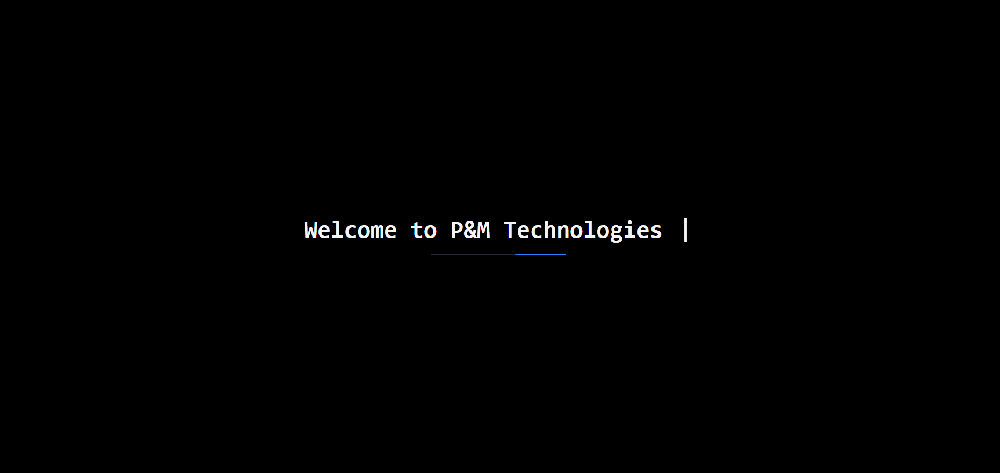
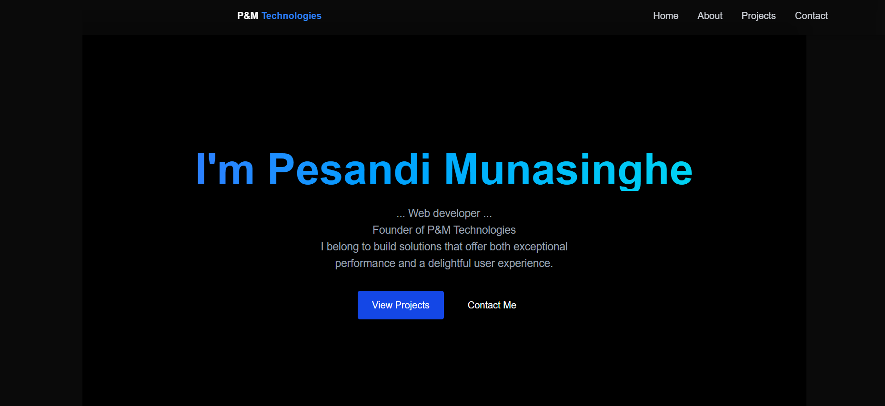
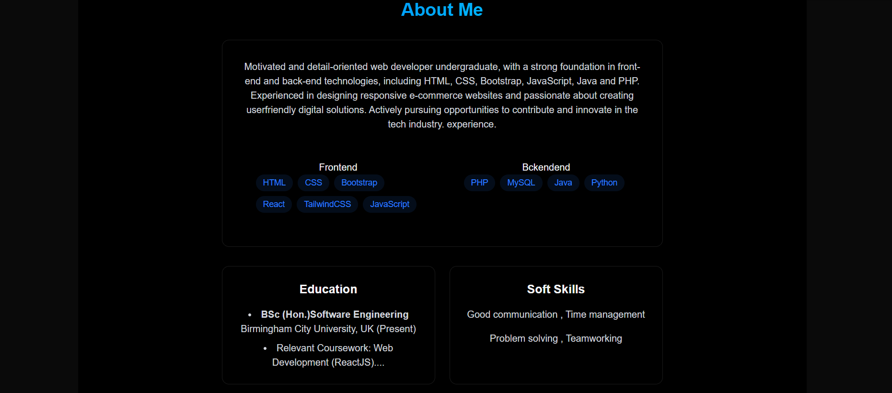
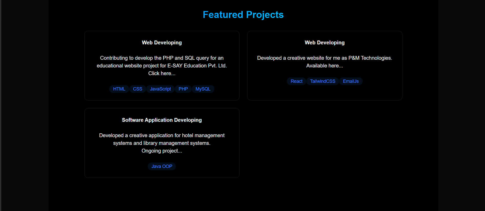
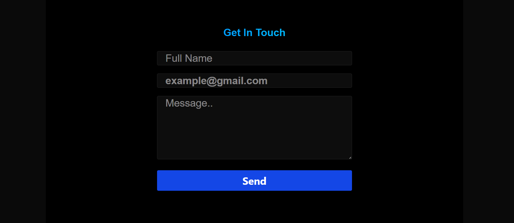

<h1>My Official Website - P&M Technologies</h1>
<h2>My introductional website using React.js + Tailwindcss + JavaScript + PHP + MySQL</h2>

This site introduce me and my hands on experiences. This site includes Home page, About me, Education, Soft skills, Featured Products and contact me sections. As Frontend tecnologies I used mainly Reactjs, JavaScript and as a framework I used TailwindCSS. As the Backend technologies I used PHP to connect with database with using MySQL queries. Inadvance, I used Ajax technology to perform actions in the background without reloading the entire web page, which creates a faster and more user-friendly experience. 

 

<h3>1. Loading the home Page</h3>

 

<h3>2. Home Page view</h3>

 

<h3>3. About Me view</h3>

 

<h3>4. Featured Products view</h3>

 

<h3>5. Contact Me view</h3>

 

<h2>Referances</h2>

Vite (2019). Getting Started. [online] vitejs. Available at: https://vite.dev/guide/.

‌tailwindcss.com. (n.d.). Tailwind CSS - Rapidly build modern websites without ever leaving your HTML. [online] Available at: https://tailwindcss.com.

‌
